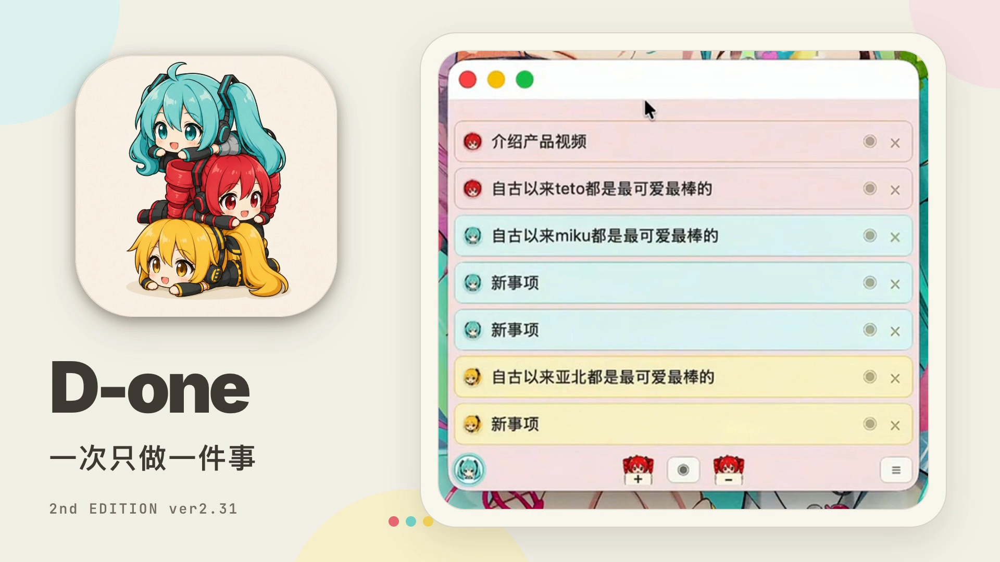
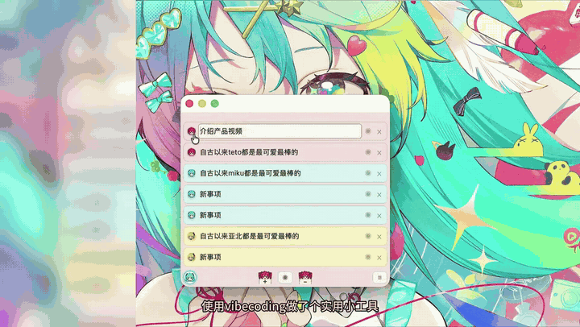
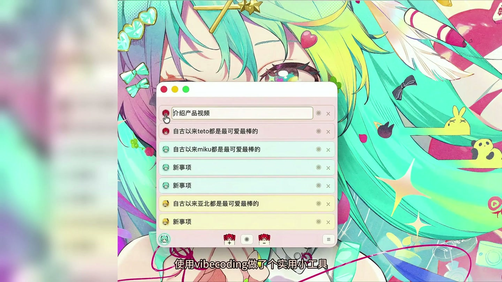
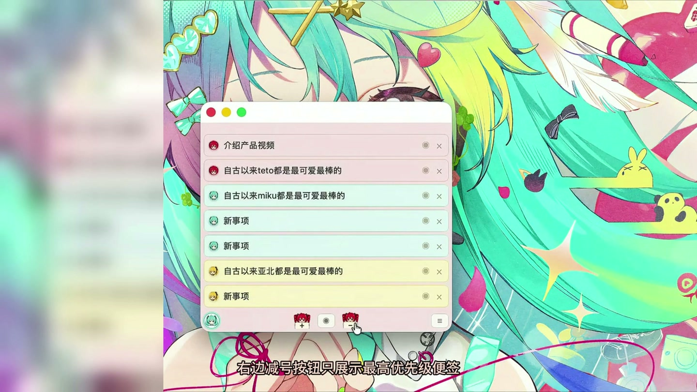

# D-one

  

<strong>一次只关注最重要的一件事。</strong>

  <a href="https://github.com/acekira3-afk/d-one-releases/releases/download/v2.31/D-one.2nd.EDITION.ver2.31.dmg"><strong>⬇️ 下载 D-one 2nd EDITION ver2.31</strong></a>
  ·
  <a href="https://github.com/acekira3-afk/d-one-releases/issues/new/choose">提交反馈</a>

D-one 是一款极简、始终置顶的 macOS 桌面优先级便签。把事项拖到最上方，它就成为当前优先级最高的任务；切换到单行模式后，桌面上只保留这一件事。

> 当前为个人制作的非商业公开测试版。ver2.32 preview 的[可构建源码](source/ver2.32-preview/)已公开供查看和测试；代码暂未选定开源许可证，角色素材也不因此获得额外授权。

**尝鲜预览：** [下载 ver2.32 preview DMG](https://github.com/acekira3-afk/d-one-releases/raw/refs/heads/main/downloads/D-one-2nd-EDITION-ver2.32-preview.dmg) · [查看源码](source/ver2.32-preview/) · [查看变更和校验值](RELEASE-NOTES-v2.32-preview.md)。本版新增每条主便签的独立子便签窗口、跟随分类的配色、角色桌面形象，以及实验性的模型对话。它与 v2.31 使用独立应用标识，便签数据不会自动同步；正式推荐下载仍是上方的 v2.31。

## 8 秒看懂 D-one

  

## 它解决什么问题

日常工作时，新想法经常突然出现，原本正在做的事情很容易被打断。D-one 不建立复杂的项目体系，只把当前最重要的事项持续留在桌面前端。

- **始终置顶**：小窗口低干扰地停留在桌面
- **直接编辑**：点击便签文字即可输入和修改
- **拖动排序**：从上到下就是事项优先级
- **单行聚焦**：只显示最上方、优先级最高的事项
- **独立隐藏**：暂时不想看到的事项可以保留但隐藏
- **颜色分类**：颜色只代表类别，不会改变排序规则
- **2nd EDITION主题**：分类与背景随角色主题变化

| 编辑与分类 | 单行聚焦 |
| --- | --- |
|  |  |

## 下载与系统要求

| 项目 | 说明 |
| --- | --- |
| 当前版本 | D-one 2nd EDITION ver2.31 |
| 下载 | [Universal DMG（直接下载）](https://github.com/acekira3-afk/d-one-releases/releases/download/v2.31/D-one.2nd.EDITION.ver2.31.dmg) |
| 处理器 | Apple Silicon 与 Intel Mac |
| 系统 | macOS 14 或更高版本 |
| 签名状态 | 临时签名，尚未经过 Apple 公证 |
| SHA-256 | `c342265c943f0be299851e617b915574129b09fa3fc3c96045c5a68a71c2fc41` |

完整发布说明位于 [v2.31 Release 页面](https://github.com/acekira3-afk/d-one-releases/releases/tag/v2.31)。请只从本仓库下载测试包。

## 安装与首次打开

1. 下载并打开 DMG。
2. 将 `D-one.app` 拖入 `Applications`。
3. 因测试版尚未经过 Apple 公证，首次启动请在 Finder 中右键 `D-one.app`，选择 **打开**。
4. 如果仍被系统阻止，请前往 **系统设置 → 隐私与安全性 → 仍要打开**。

无需关闭 Gatekeeper，也不要在聊天或任何第三方页面输入系统密码。

## 参与测试

如果你愿意帮忙测试，最有价值的信息是：

1. Mac 型号、芯片和 macOS 版本。
2. 是否能够正常安装并首次打开。
3. 哪个操作让你困惑或没有达到预期。
4. 你是否愿意每天把它留在桌面上。

可以使用 [错误反馈](https://github.com/acekira3-afk/d-one-releases/issues/new?template=bug-report.yml) 或 [功能建议](https://github.com/acekira3-afk/d-one-releases/issues/new?template=feature-request.yml)。如果“一次只做一件事”的设计对你有帮助，也欢迎点一个 Star，让更多人看到它。

## 接下来

- 收集不同 Intel 与 Apple Silicon Mac 的真实测试结果
- 继续改善单行模式和隐藏事项管理
- 准备完全原创的 Classic 视觉主题
- 评估正式 Developer ID 签名与 Apple 公证

## 非官方二次创作声明

本项目是个人制作的非官方、非商业软件设计与二次创作测试，与相关角色官方及权利方不存在隶属、授权、赞助或合作关系。

- 角色相关权利归各自权利方所有。
- 初音未来相关二次创作请参阅 [Piapro Character License（PCL）](https://piapro.jp/license/pcl/summary)。
- 重音 Teto 相关二次创作请参阅 [重音 Teto 官方角色使用规则](https://kasaneteto.jp/guidelines/character.html)。
- 亚北音留相关权利归原作者及相应权利方所有。
- 角色插图由 AI 辅助生成，仅用于本非商业测试版的视觉展示。
- 本仓库不授予任何第三方角色、名称或形象的再利用权利。

软件交互与程序由 D-one 项目制作。软件的抽象想法、处理过程和操作方法不因本说明而被声明为第三方角色权利的一部分。

---

## English

**D-one** is a minimal, always-on-top priority note for macOS. Drag a task to the top to make it the current priority, or switch to single-line mode to keep only that one task visible.

- [Download the Universal DMG](https://github.com/acekira3-afk/d-one-releases/releases/download/v2.31/D-one.2nd.EDITION.ver2.31.dmg)
- Supports Apple Silicon and Intel Macs
- Requires macOS 14 or later
- Ad-hoc signed and not Apple-notarized; use Finder's right-click **Open** flow on first launch
- SHA-256: `c342265c943f0be299851e617b915574129b09fa3fc3c96045c5a68a71c2fc41`

This is an unofficial, personal, non-commercial public test build. The [ver2.32 preview source](source/ver2.32-preview/) is available for inspection and testing, but no code license has been chosen. Character-related rights belong to their respective rightsholders; publishing the source does not grant rights to those assets. No affiliation, endorsement, sponsorship, or official authorization is claimed.
