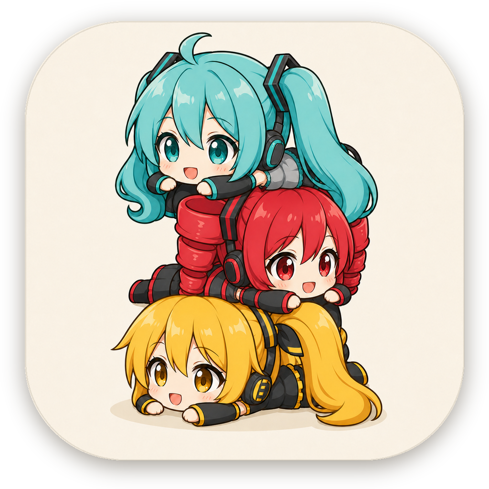

# D-one

  

<strong>一次只关注最重要的一件事。</strong>

D-one 是一款极简、始终置顶的 macOS 桌面优先级便签。它不试图成为复杂的项目管理器，而是让当前最重要的事项一直保持可见。

> 当前版本：**D-one 2nd EDITION ver2.31**（非商业公开测试版）

## 下载

前往 [最新 Release](https://github.com/acekira3-afk/d-one-releases/releases/latest) 下载 Universal DMG。

- 支持 Apple 芯片与 Intel Mac
- 需要 macOS 14 或更高版本
- 当前为临时签名、尚未经过 Apple 公证的测试包

## 主要功能

- 小窗口始终置顶，低干扰地留在桌面
- 直接点击文字编辑事项
- 拖动事项决定优先顺序
- 单行模式只显示最高优先级事项
- 可单独隐藏事项并集中管理
- 颜色仅用于任务分类
- 2nd EDITION 歌姬主题

## 安装与首次打开

1. 打开下载的 DMG。
2. 将 `D-one.app` 拖入 `Applications`。
3. 因测试版尚未经过 Apple 公证，首次启动时请在 Finder 中右键 `D-one.app`，选择“打开”。
4. 如果仍被系统阻止，请前往“系统设置 → 隐私与安全性”，选择“仍要打开”。

请只从本仓库的 Releases 页面下载测试包。

## 反馈与 Star

欢迎通过 [Issues](https://github.com/acekira3-afk/d-one-releases/issues) 提交体验反馈。如果你喜欢“一次只做一件事”的设计，也欢迎为仓库点一个 Star。

## 非官方二次创作声明

本项目是个人制作的非官方、非商业软件设计与二次创作测试，与相关角色官方及权利方不存在隶属、授权、赞助或合作关系。

- 角色相关权利归各自权利方所有。
- 初音未来相关二次创作请参阅 [Piapro Character License（PCL）](https://piapro.jp/license/pcl/summary)。
- 重音 Teto 相关二次创作请参阅 [重音 Teto 官方角色使用规则](https://kasaneteto.jp/guidelines/character.html)。
- 亚北音留相关权利归原作者及相应权利方所有。
- 角色插图由 AI 辅助生成，仅用于本非商业测试版的视觉展示。
- 本仓库不授予任何第三方角色、名称或形象的再利用权利。

软件交互与程序由 D-one 项目制作。源码目前保持私有，本仓库仅用于公开展示和分发非商业测试构建。

---

## English

D-one is a minimal always-on-top priority note for macOS. It keeps your most important task visible without turning into a full project-management system.

The current release is a personal, non-commercial public test build. It supports both Apple Silicon and Intel Macs running macOS 14 or later. The build is ad-hoc signed and not Apple-notarized, so macOS may require the right-click **Open** flow on first launch.

This is an unofficial fan-made derivative project. Character-related rights belong to their respective rightsholders. AI-assisted character artwork is used only for this non-commercial test presentation. No affiliation, endorsement, sponsorship, or official authorization is claimed.

